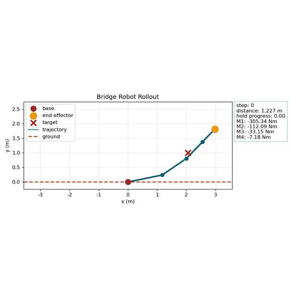
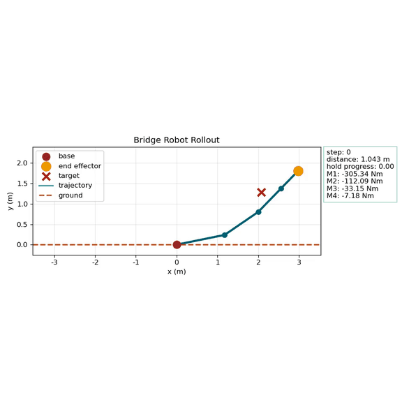
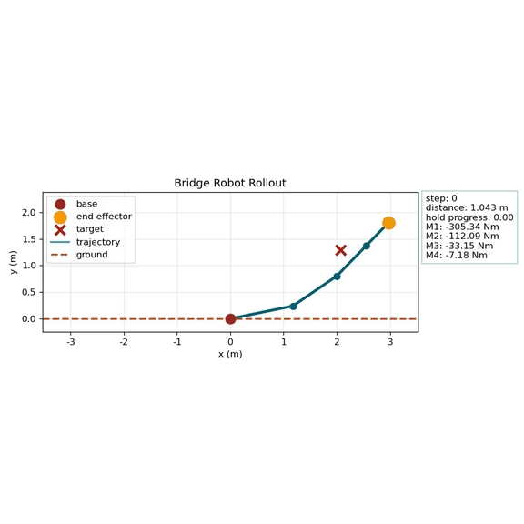
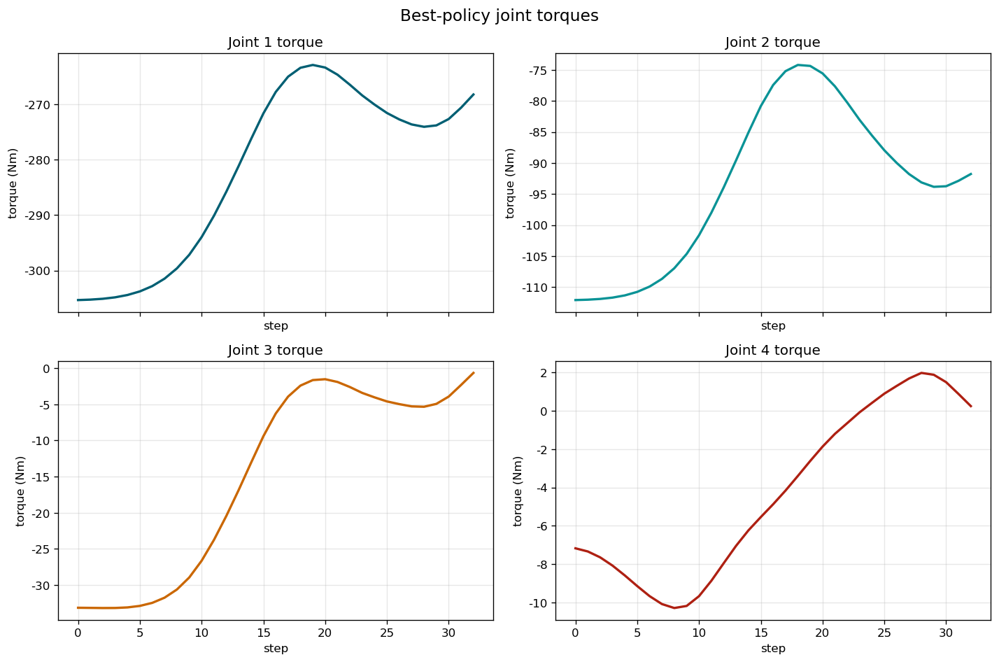

# Four-Link Reinforcement Learning for Torque Control

## Overview

This repository studies torque control for a four-link manipulator with reinforcement learning. A mechanics-based simulator is used directly as the environment, and SAC is trained to drive the end effector to a target region under dynamic constraints.

## Project Motivation

The project follows a simple three-stage workflow.

1. A physical model is established from theoretical mechanics, including kinematics, dynamics, damping, gravity, and joint torque limits.
2. The simulator is wrapped as a reinforcement learning environment.
3. A policy is trained and evaluated through rollout videos across different optimization stages.

## Method

The simulator models a four-link manipulator with explicit kinematics and dynamics. The RL task uses a 4D normalized torque action, and training is performed with SAC using `MlpPolicy`. A rollout is counted as successful only when the end effector reaches the tolerance region and stays there for several consecutive steps.

## Environment and Learning Setup

The main task uses the following settings.

- 4-DoF continuous torque control
- SAC with `MlpPolicy`
- Simulation time step `dt = 0.02`
- Maximum episode length `250` steps
- Success tolerance `0.08`
- Success hold requirement `5` consecutive steps
- Target region sampled in the upper half-plane
- Python `3.10`, with dependencies defined in [`requirements.yaml`](requirements.yaml)

The training entry point is [`scripts/train_rl.py`](scripts/train_rl.py), and the default configuration is defined in [`configs/train_rl.yaml`](configs/train_rl.yaml) and [`configs/default.yaml`](configs/default.yaml).

## Training Progress and Results

The results below come from the SAC run `sac_torque_control_20260312-124907_f23d` on March 12, 2026. The overall trend is clear: early training mainly improves whether the manipulator can reach the target region, while later training improves how quickly it can do so.

### Stage 50k



At 50k steps, the policy is still far from stable target reaching.  
Video: [stage-050k.mp4](docs/media/stage-050k.mp4)

### Stage 100k



At 100k steps, the controller moves much closer to the target, but it is still not reliably successful.  
Video: [stage-100k.mp4](docs/media/stage-100k.mp4)

### Stage 200k



At 200k steps, the behavior is close to the success threshold, showing strong improvement in target-reaching quality.  
Video: [stage-200k.mp4](docs/media/stage-200k.mp4)

### Stage 500k


At 500k steps, the policy begins to satisfy the success condition and reaches the target faster.  
Video: [stage-500k.mp4](docs/media/stage-500k.mp4)

### Best Policy


The final best policy is the canonical result of this run. It demonstrates both stable reaching and improved efficiency.  
Video: [best-policy.mp4](docs/media/best-policy.mp4)



The final torque profile shows how the learned controller distributes effort across the four joints during a successful rollout.

## How to Run

Create the environment and install dependencies:

```bash
conda env create -f requirements.yaml
conda activate bridge-robot-cloud
```

Train the torque-control policy:

```bash
python scripts/train_rl.py
```

Run the test suite:

```bash
python -m pytest tests
```

The original workflow used local development and cloud-based training.

## Repository Layout

```text
.
|-- configs/
|-- docs/
|   `-- media/
|-- env/
|-- scripts/
|-- tests/
|-- visualization/
|-- requirements.yaml
`-- README.md
```

Key files:

- [`env/bridge_robot_env.py`](env/bridge_robot_env.py): mechanics-based simulator
- [`env/torque_control_env.py`](env/torque_control_env.py): RL wrapper for continuous torque control
- [`scripts/train_rl.py`](scripts/train_rl.py): SAC training entry point
- [`visualization/`](visualization): plotting, rendering, and rollout export utilities

## Conclusion

This project presents a compact pipeline for four-link manipulator control with reinforcement learning. The experiments show a clear two-stage trend: early optimization improves target reaching, and later optimization improves speed. The final policy not only reaches the target region more reliably, but does so in fewer steps.
