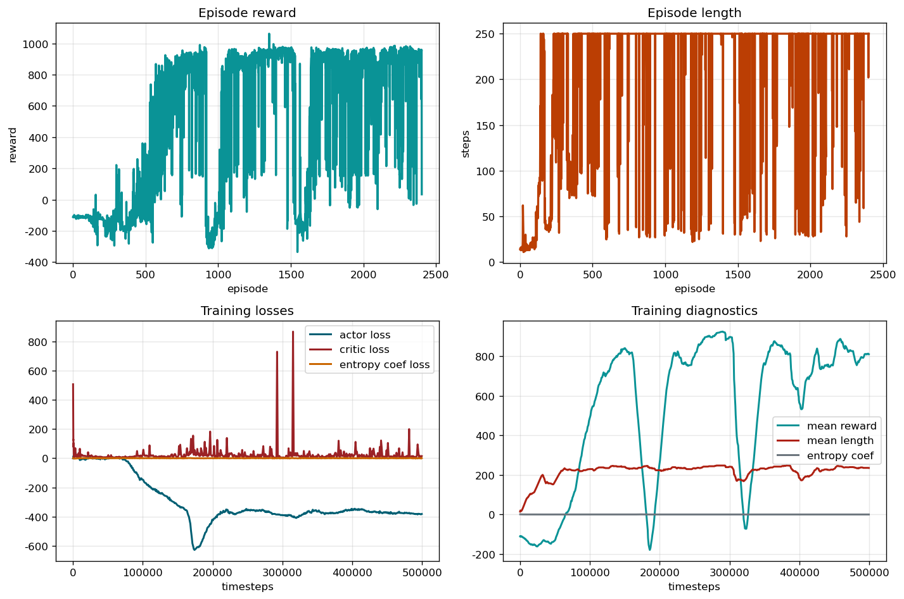

# Four-Link Reinforcement Learning for Torque Control

## Overview

This repository studies torque control for a four-link manipulator through reinforcement learning. The core idea is to build a physics model from theoretical mechanics, expose that model as a continuous-control environment, and train a policy that can drive the end effector to a target region under realistic dynamic constraints.

The current mainline task is a 4-DoF torque-control problem implemented with a custom simulator and trained with Soft Actor-Critic (SAC). The project is organized as a compact research prototype that combines modeling, environment design, training, and rollout visualization in a single codebase.

## Project Motivation

The project follows a three-stage workflow.

1. A physical model is established from theoretical mechanics, including kinematics, dynamics, damping, gravity, and joint torque limits.
2. The resulting simulator is wrapped as a reinforcement learning environment, so the agent interacts directly with the mechanics-based system instead of a simplified surrogate.
3. A reinforcement learning policy is trained on that environment, and rollout videos are used to show how the control behavior improves over the course of optimization.

This makes the repository suitable for readers who want to see a full pipeline from physical modeling to learning-based control in one reproducible project.

## Method

The simulator is defined by a four-link manipulator model with explicit kinematics and dynamics. On top of this simulator, the project builds an RL environment in which the action is a four-dimensional normalized torque command and the observation summarizes the robot state, target-relative geometry, and short-term control history.

Training is performed with SAC using `MlpPolicy`. The learning objective is not only to approach the target but to do so under a strict success condition: the end effector must enter the tolerance region and remain there for several consecutive simulation steps. This makes the task closer to stable reaching than to one-step target touching.

## Environment and Learning Setup

The main task uses the following settings.

- 4-DoF continuous torque control
- SAC with `MlpPolicy`
- Simulation time step `dt = 0.02`
- Maximum episode length `250` steps
- Success tolerance `0.08`
- Success hold requirement `5` consecutive steps
- Target region sampled in the upper half-plane
- Python `3.10`, with dependencies defined in [`requirements.yaml`](requirements.yaml)

The training entry point is [`scripts/train_rl.py`](scripts/train_rl.py), and the default configuration is defined in [`configs/train_rl.yaml`](configs/train_rl.yaml) and [`configs/default.yaml`](configs/default.yaml).

## Training Progress and Results

The results below come from the SAC run `sac_torque_control_20260312-124907_f23d` on March 12, 2026. They illustrate a clear change in optimization behavior over time: early training mainly improves target-reaching quality, while later training improves efficiency, reflected by shorter successful episodes.

### Quantitative Summary

| Stage | Mean Final Distance | Mean Episode Length | Success Rate |
| --- | ---: | ---: | ---: |
| 50k | 0.5338 | 250.0 | 0.0 |
| 100k | 0.1333 | 250.0 | 0.0 |
| 200k | 0.0828 | 250.0 | 0.0 |
| 500k | 0.0944 | 206.4 | 0.2 |
| Best policy | 0.0944 | 206.4 | 0.2 |

The table shows that the policy first learns how to reduce terminal error. By the late stage, it begins to solve the task within fewer steps, indicating that optimization shifts from merely reaching the target region to reaching it faster and more decisively.

### Training Curve



The training curve summarizes the optimization trajectory recorded during the SAC run.

### Stage 50k


At 50k steps, the policy has not yet learned stable success, and the rollout still shows noticeable terminal error.  
Video: [stage-050k.mp4](docs/media/stage-050k.mp4)

### Stage 100k


At 100k steps, the controller moves much closer to the target, but success is still not consistently achieved under the hold criterion.  
Video: [stage-100k.mp4](docs/media/stage-100k.mp4)

### Stage 200k


At 200k steps, the final distance is already close to the success threshold, showing that the main gain in this phase is target-reaching quality.  
Video: [stage-200k.mp4](docs/media/stage-200k.mp4)

### Stage 500k


At 500k steps, the policy begins to satisfy the success condition and finishes successful episodes in fewer steps on average.  
Video: [stage-500k.mp4](docs/media/stage-500k.mp4)

### Best Policy


The final best policy is the canonical result of this run. It demonstrates both target-reaching ability and improved efficiency under the same mechanics-based environment.  
Video: [best-policy.mp4](docs/media/best-policy.mp4)


The final torque profile shows how the learned controller distributes effort across the four joints during a successful rollout.

## How to Run

Create the environment and install dependencies:

```bash
conda env create -f requirements.yaml
conda activate bridge-robot-cloud
```

Train the torque-control policy:

```bash
python scripts/train_rl.py
```

Run the test suite:

```bash
python -m pytest tests
```

The original workflow was developed locally and executed for training on a separate cloud environment, but the repository itself remains self-contained for documentation, inspection, and reproduction.

## Repository Layout

```text
.
|-- configs/
|-- docs/
|   `-- media/
|-- env/
|-- scripts/
|-- tests/
|-- visualization/
|-- requirements.yaml
`-- README.md
```

Key files:

- [`env/bridge_robot_env.py`](env/bridge_robot_env.py): mechanics-based simulator
- [`env/torque_control_env.py`](env/torque_control_env.py): RL wrapper for continuous torque control
- [`scripts/train_rl.py`](scripts/train_rl.py): SAC training entry point
- [`visualization/`](visualization): plotting, rendering, and rollout export utilities

## Conclusion

This project shows a complete pipeline for four-link manipulator control with reinforcement learning. A physics model derived from theoretical mechanics is used directly as the learning environment, and SAC learns a torque policy on top of that model.

The experimental results show a two-phase improvement pattern. In the early stage, optimization mainly improves the ability to reach the target region. In the later stage, optimization improves speed and efficiency, as shown by fewer steps to finish successful episodes. In other words, the learned policy does not only get closer to the target over time; it also becomes faster at completing the task once target-reaching behavior has been established.
